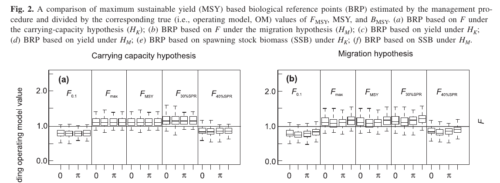
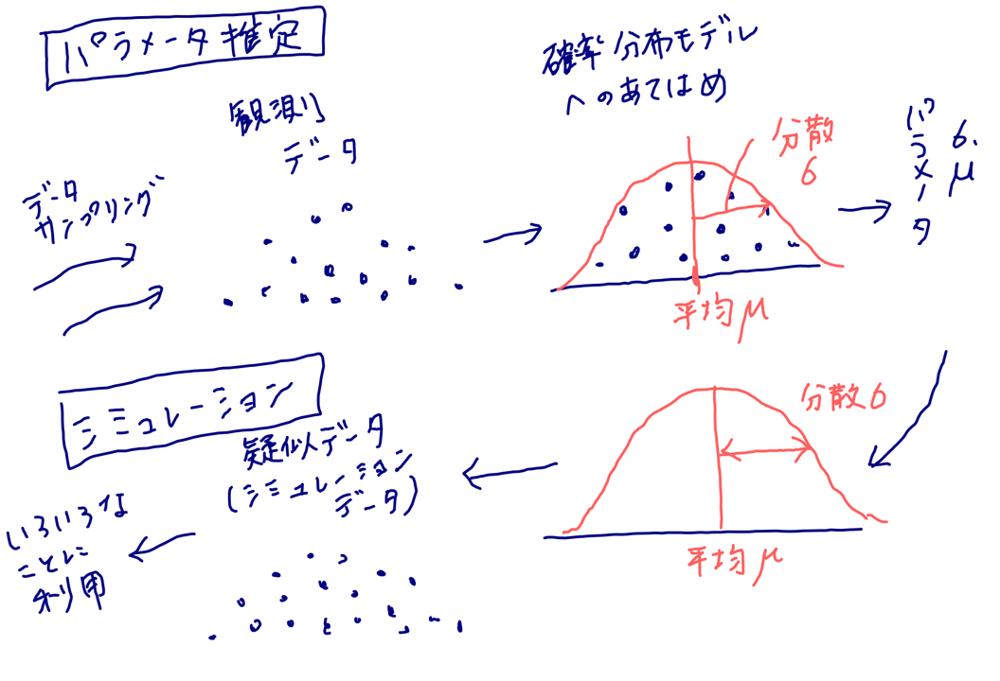
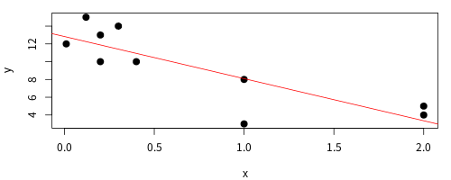
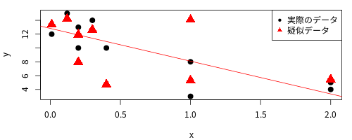
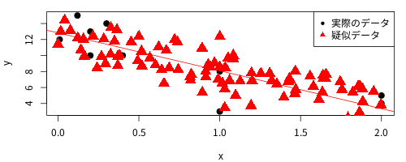
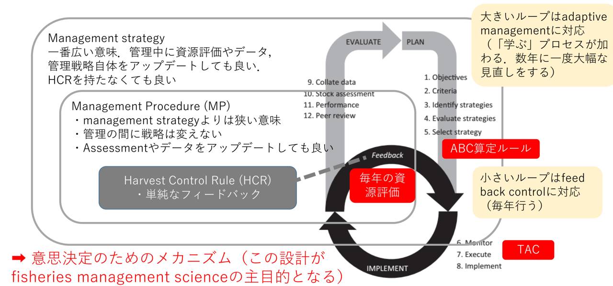

# 今までの話

データをもとにした統計モデルにおけるパラメータ推定・資源動態モデルを用いた資源量推定

:arrow_down: 

データを最も良く説明できるモデルを得た！

:arrow_down:

モデルのより応用的な利用：
管理戦略評価（Management Strategy Evaluation, MSE）
	    
---

    		
# プレゼンの流れ	

- MSEとは？
   - モデル推定の不確実性（MSYの不確実性にまつわるクロマグロの例）
   - MSEとは？
   - パラメータ推定/シミュレーション/MSE
- MSEの流れ
- 2系ルールはどのようにして決まったか？
   - 1系ルールと2系ルール
   - 考慮している不確実性
   - 「スコア」方式  
- まとめ
    		
---
	
<!-- header: MSEとは？  -->			
# モデル推定の不確実性

- 推定できたといってもパラメータに大きな**不確実性**がある、、、
   - 推定パラメータの信頼区間が非常に広い
   - 局所解が２つ以上ある
   - そもそも、そのパラメータを推定できるだけの情報がない

:arrow_down:

このような場面は（特に水産資源解析においては）往々にしてある

---
	
# 水産資源解析における大きな不確実性の例: <br> MSY (Maximum Sustainable Yield)

  
**〜 MSY推定のための条件〜** 
- 資源評価の結果がある程度正しい
   - データ不足のためにちゃんとした資源量推定ができない...
- 余剰生産曲線（または再生産関係、加入と親魚量の関係）の推定が確からしい
   - 親子関係がほぼ見られない...
   - レジームシフトがありそう...	    
   
！かなりハードルが高い！

---

## 大西洋クロマグロの資源評価における事例	

- 漁獲なしでも資源量が歴史的に変動：carrying capacityの変動か、東西移動か？
   


<!-- _footer: Fromentin, Jean-Marc & Kell, Laurence. (2007). Can J Fish Aquat Sci. 64:827-836 -->
	   
---

## 大西洋クロマグロの資源評価における事例
   	
- 再生産関係もあいまい	


<!-- _footer: 2017年大西洋クロマグロ資源評価レポート（上図は西資源の再生産関係） https://www.iccat.int/Documents/SCRS/DetRep/BFT_SA_ENG.pdf -->
     
---

## 大西洋クロマグロの資源評価における事例
   
 
			        
 :arrow_right:  **信頼できるMSY管理基準値が計算できない**
    
 :arrow_right:  **MSE！**


 

   
---

## 大西洋クロマグロの資源評価における事例

- 環境収容力の変化または回遊の変化がある場合、どの管理基準値が良い？
- 環境・回遊シナリオ  vs. さまざまな管理基準値

 

<!-- _footer: Kell, Laurence & Fromentin, Jean-Marc. (2007). Can J Fish Aquat Sci. 64:837-847 -->
     
---

## 大西洋クロマグロの資源評価における事例

- 環境収容力の変化または回遊の変化がある場合、どの管理基準値が良い？
- 環境・回遊シナリオ  vs. さまざまな管理基準値 :arrow_right: **F0.1が管理基準値に**

  
			     
<!-- _footer: Kell, Laurence & Fromentin, Jean-Marc. (2007). Can J Fish Aquat Sci. 64:837-847 -->
     
---		

# MSEとは？

管理のために、何がしかのパラメータ推定値（例：MSY管理基準値）を利用したい。しかし、その推定値には大きな不確実性が含まれる/さまざまな対立仮説があって選べない、、、。MSEはそのような状況を打開するために開発された方法。

- IWCの商業捕鯨の管理方式：元祖
- ミナミマグロの管理：成功の最初の例
- 我が国資源の管理方策（2系ルール、新ルールのHCR）    

---

# MSEとは？：もっと具体的に

- 個体群動態（魚のふるまい）・漁業動態（漁業者のふるまい）・管理方策（管理のやりかた）を模倣するコンピュータシミュレーションを作り、シミュレーション上で**仮想の管理**を実施する
   - シミュレーションなので、失敗してもOK！
   - どんなやり方も・何回でも試せる
   - 「よくわかっていない」部分については、満足するまで様々なシナリオを用意できる
- どのようなシナリオのもとでも平均的にうまくいくような（大失敗しないような）管理方策を選択できる
   - 選択の基準を定量化できる
   - どのようなシナリオが想定されているかが明確    
	
---

# **パラメータ推定/シミュレーション**/MSE 	


		  
---

# **パラメータ推定**/シミュレーション/MSE 	

```
# データをサンプリングする
data_x <- c(0.4,2,1,0.01,1,2,0.12,0.2,0.2,0.3)  
data_y <- c( 10,4,8,12,3,5,15,13,10,14)
# パラメータを推定する       
lres <- lm(data_y~data_x)
lres$coeff
# (Intercept)      data_x 
#  12.825102   -4.737347 	
```


<!---
png(file="fig-plot.png",height=200,width=500)
par(mar=c(4,4,1,1))
plot(data_x, data_y, xlab="x", ylab="y",pch=20,cex=2)
abline(lres,col=2)
dev.off()
--->	
	
---		

# パラメータ推定/**シミュレーション**/MSE 	

```
# モデルのパラメータを決める
intercept <- lres$coeff[1]
slope <- lres$coeff[2]	  
sigma <- summary(lres)$sigma
# 疑似データを発生させる
pdata_y <- intercept + slope * data_x + rnorm(length(data_x),sd=sigma) 
```


<!---
png(file="fig-plot2.png",height=200,width=500)
par(mar=c(4,4,1,1))
plot(data_x, data_y, xlab="x", ylab="y",pch=20,cex=2)
points(data_x, pdata_y, xlab="x", ylab="y",pch=17,cex=2,col=2)
abline(lres,col=2)
legend("topright",legend=c("実際のデータ","疑似データ"),pch=c(20,17),col=1:2,cex=1)
dev.off()
--->	

---		

# パラメータ推定/**シミュレーション**/MSE 	

```
# 疑似データなので、何個でも、どの値に対しても生成できる
pdata_x <- runif(100,min=0,max=2)  
pdata_y2 <- intercept + slope * pdata_x + rnorm(100,sd=sigma) 
```



<!---
png(file="fig-plot3.png",height=200,width=500)
par(mar=c(4,4,1,1))
plot(data_x, data_y, xlab="x", ylab="y",pch=20,cex=2)
points(pdata_x, pdata_y2, xlab="x", ylab="y",pch=17,cex=2,col=2)
abline(lres,col=2)
legend("topright",legend=c("実際のデータ","疑似データ"),pch=c(20,17),col=1:2,cex=1)
dev.off()
--->
		
---
			
# パラメータ推定/シミュレーション/**MSE**

- もっと複雑なシミュレーション＋さまざまな管理＋管理に対するフィードバック
	


	
---

# パラメータ推定/シミュレーション/**MSE**

-もう少しちゃんとした図	


<!-- _footer: 市野川・岡村 (2016). 統計数理. 64:59-75 -->
     
---
	
<!-- header: MSEの流れ  -->
     	
# MSEの流れ
  
Punt and Donovan (2007)では、MSEの具体的な手順を以下のようにまとめている。
     
1. 管理の目的を（定性的に）決め、優先順位づけをおこなう
2. 管理目標を達成したかを測る定量的なパフォーマンス指標を選ぶ
3. 核となるシミュレーションモデルを決める
4. 候補となる管理方策を決める
5. シミュレーションの中で管理方策を適用する
6. ここの管理方策のパフォーマンスをまとめる
7. 管理目的に最もそぐう管理方策を選択する

<!-- _footer: Punt, André & Donovan, Greg. (2007). ICES J MAR SCI. 64. 603-612. -->
     
---   	

## 1. 管理目的を決める
- 定性的なもので、ステークホルダーが決める=MSE開発初期からステークホルダが関わることが重要
- 一般的には、資源の持続性・漁獲量・安定性の3つの要素
    
## 2. 管理目標の達成程度を測る定量的なパフォーマンス指標を選ぶ
- MSEの中で、1)で決められた管理目標が達成されたと判断するための統計量を決める
- 例) 20XX年にXX％の確率でXXXまで回復している確率, 平均漁獲量がMSYの80%以上, など

---

## 3. 着目すべき不確実性を選択する
- 現実の個体群動態と漁業動態を代表するシミュレーションモデルを開発し、パラメータを決める   


---

#


---

#


---				

---
	
<!-- header: 2系ルールはどのようにして決まったか？  -->
     	
# 2系ルールはどのようにして決まったか？


---

<!-- header: 2系ルールはどのようにして決まったか？  -->
     	
# 現行のABC算定ルール

利用できるデータや評価モデルの特徴にあわせて1-1, 1-2, 1-3, 2-1, 2-2系に分類

|タイプ| 利用できるデータなど   |代表的魚種|
|---|---|---|	 
|1-1  | 再生産関係のプロットあり・Blimit設定あり   | 主なTAC魚種|
|1-2  | 資源量推定あり・Bmsy,Fmsyの推定あり（プロダクションモデル）   |なし|  	     	 
|1-3  | 再生産関係のプロットあり・Blimitの設定なし  | トラフグ伊勢三河系群 |
|2-1  | 資源量指標値と漁獲量が得られている  | ？？？ |
|2-2  | 漁獲量のみ  | ホッケ道南系群 |      

<!-- _footer:平成30(2018)年度ABC算定のための基本規則 http://abchan.fra.go.jp/digests2018/rule/rule2018.pdf  -->
           
---

# 資源量推定がない2-1系 (と2-2系) をどう管理するか？

現行ルールと現行ルール以前の場合
1.  水準を決める
    - だいたいは、最小値と最大値を3等分して下から低位・中位・高位
  


			  	
---


		# 水産資源の管理システム:さまざまなフィードバック
	


<!-- _footer: Edwards and Dankel (eds) (2016). Management science in fisheries. chapter 1 -->
     
---			

## Management strategy: 一番大きいループ
- どのように・何を管理するか、全体的な管理設計をおこなう
- 順応的管理的数年に一度、大幅

<!---
# 2系コード
devtools::install_github("ichimomo/frasyr23")  
library(frasyr23)
data(data_aka)

min.max <- range(data_aka$cpue)
min.max <- c(min.max,min.max[1]+diff(min.max)*c(1,2)/3) %>%
	sort()
	
graph_2kei_example <- data_aka %>% ggplot() + geom_line(aes(x=year,y=cpue),size=2,color="skyblue")+
	 ylim(0,NA)+theme_bw(base_size=20)+
	 geom_hline(yintercept=min.max[c(2,3)],linetype=2,col="pink",size=2)+
	 geom_label(data=tibble(x=2008,y=min.max[1:3]+diff(min.max)[1]/2,
	            label=c("低位", "中位","高位")),
		    mapping=aes(x=x,y=y,label=label),size=7)
ggsave(graph_2kei_example,file="graph_2kei_example.png",height=5,width=10)		    
		    
	 		
	---> 