# 今までの話

データをもとにした統計モデルにおけるパラメータ推定・資源動態モデルを用いた資源量推定

:arrow_down: 

データを最も良く説明できるモデルを得た！

:arrow_down:

モデルのより応用的な利用：
管理戦略評価（Management Strategy Evaluation, MSE）
	    
---
    		
# プレゼンの流れ	

- MSEとは？
   - MSEとは？
   - パラメータ推定とシミュレーションとMSE
   - MSEの流れ
   - MSEの利点・欠点・まとめ
- 2系ルールのMSE
- まとめ
    		
---
	
<!-- header: MSEとは？ -->			
# モデル推定の不確実性

- 推定できたといっても、、、
   - 推定パラメータの信頼区間が非常に広い
   - 局所解が２つ以上ある
   - そもそも、そのパラメータを推定できるだけの情報がない
   - 別のモデルがもしかしたら正しいかもしれない、、、

:arrow_down:

モデルの「**不確実性**」：このような場面は（特に水産資源解析においては）往々にしてある

---
	
# MSEとは？

管理のために、何がしかのパラメータ推定値（例：MSY管理基準値）を利用したい。しかし、その推定値には大きな不確実性が含まれる/さまざまな対立仮説があって選べない、、、。MSEはそのような状況を打開するために開発された方法。

- IWCの商業捕鯨の管理方式：元祖
- ミナミマグロの管理：成功の最初の例
- 我が国資源の管理方策（2系ルール、新ルールのHCR）    

---

# MSEとは？：もっと具体的に

- 個体群動態（魚のふるまい）・漁業動態（漁業者のふるまい）・管理方策（管理のやりかた）を模倣するコンピュータシミュレーションを作り、シミュレーション上で**仮想の管理**を実施する
   - シミュレーションなので、失敗してもOK！
   - どんなやり方も・何回でも試せる
   - 「よくわかっていない」部分については、満足するまで様々なシナリオを用意できる
- どのようなシナリオのもとでも平均的にうまくいくような（大失敗しないような）管理方策を選択できる
   - 選択の基準を定量化できる
   - どのようなシナリオが想定されているかが明確    
	
---

# **パラメータ推定とシミュレーション**とMSE 	


		  
---

# **パラメータ推定**とシミュレーションとMSE 	

```
# 水深別の魚のCPUEを調査
Depth <- c(10,4,8,12,3,5,15,13,10,14)
log_CPUE <- c(1.3,0.4,1,1.1,0.2,0.35,2.1,2.2,1.5,1.3)

# パラメータを推定する       
lres <- lm(log_CPUE~Depth)
lres$coeff
# (Intercept)       Depth 
#  -0.2169708   0.1448905 
```

:arrow_right: 水深に対するCPUEの関係（深いほど良くとれる）を得た

---

```
png(file="fig-plot.png",height=200,width=500)
par(mar=c(4,4,1,1))
plot(log_CPUE~Depth,pch=20,cex=2,ylim=c(0,max(log_CPUE)))
abline(lres,col=2)
dev.off()
```
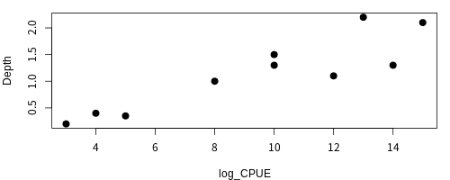

---		

# パラメータ推定/**シミュレーション**/MSE 	

```
# モデルのパラメータを決める
intercept <- lres$coeff[1]
slope <- lres$coeff[2]	  
sigma <- summary(lres)$sigma
# 疑似データを発生させる
pdata_y <- intercept + slope * Depth + rnorm(length(data_x),sd=sigma) 
```
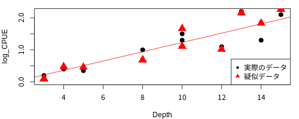

<!---
png(file="fig-plot2.png",height=200,width=500)
par(mar=c(4,4,1,1))
plot(log_CPUE~Depth,pch=20,cex=2, ylim=c(0,max(log_CPUE)))
points(Depth, pdata_y, xlab="x", ylab="y",pch=17,cex=2,col=2)
abline(lres,col=2)
legend("bottomright",legend=c("実際のデータ","疑似データ"),pch=c(20,17),col=1:2,cex=1)
dev.off()
--->	

---		

# パラメータ推定/**シミュレーション**/MSE 	

```
# 疑似データなので、何個でも、どの値に対しても生成できる
pdata_x2 <- runif(100,min=1,max=15)  
pdata_y2 <- intercept + slope * pdata_x2 + rnorm(100,sd=sigma) 
```

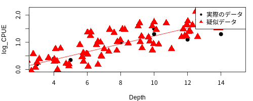

<!---
png(file="figures/fig-plot3.png",height=200,width=500)
par(mar=c(4,4,1,1))
plot(log_CPUE~Depth,pch=20,cex=2, ylim=c(0,max(log_CPUE)))
points(pdata_x2, pdata_y2, xlab="x", ylab="y",pch=17,cex=2,col=2)
abline(lres,col=2)
legend("topright",legend=c("実際のデータ","疑似データ"),pch=c(20,17),col=1:2,cex=1)
dev.off()
--->
		
---
			
# パラメータ推定/シミュレーション/**MSE**

- もっと複雑なシミュレーション＋さまざまな管理＋管理に対するフィードバック
	
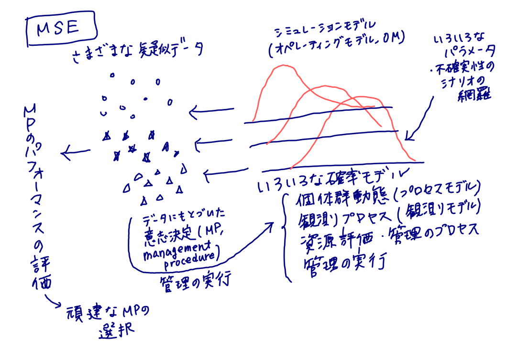

	
---

# パラメータ推定/シミュレーション/**MSE**

- シナリオ）浅い海域だけの操業と深い海域だけの操業、どちらが得か？
- 操業コスト：5千円/操業＠浅い、8千円/操業＠深い、魚は1匹あたり1万円

```
# 浅い海域で50操業
pdata_x_shallow <- runif(50,min=1,max=8)
pdata_y_shallow <- intercept + slope * pdata_x_shallow + rnorm(50,sd=sigma) 
# 深い海域で50操業
pdata_x_deep <- runif(50,min=8,max=15)
pdata_y_deep <- intercept + slope * pdata_x_deep + rnorm(50,sd=sigma)
# 利益
(profit_shallow <- sum(exp(pdata_y_shallow))-0.5*50)
# [1] 64.72737
(profit_deep <- sum(exp(pdata_y_deep))-0.8*50)
# [1] 208.0733
```

---

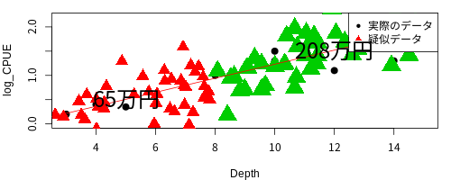

<!---
png(file="figures/fig-plot4.png",height=200,width=500)
par(mar=c(4,4,1,1))
plot(log_CPUE~Depth,pch=20,cex=2, ylim=c(0,max(log_CPUE)))
points(pdata_x_shallow, pdata_y_shallow, xlab="x", ylab="y",pch=17,cex=2,col=2)
points(pdata_x_deep, pdata_y_deep, xlab="x", ylab="y",pch=17,cex=3,col=3)
abline(lres,col=2)
legend("topright",legend=c("実際のデータ","疑似データ"),pch=c(20,17),col=1:2,cex=1)

text(5, 0.5, str_c(round(sum(exp(pdata_y_shallow))-0.5*50),"万円"),cex=2) 
text(12, 1.5, str_c(round(sum(exp(pdata_y_deep))-0.8*50),"万円"),cex=2) 

dev.off()
--->

---

# パラメータ推定/シミュレーション/**MSE**

-もう少しちゃんとした図	
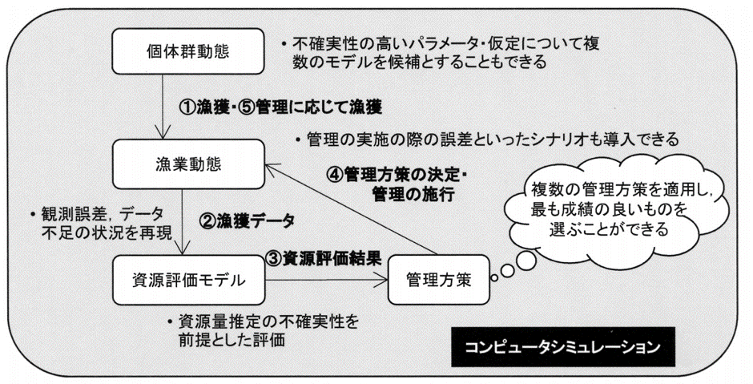

<!-- _footer: 市野川・岡村 (2016). 統計数理. 64:59-75 -->
     
---

<!-- header: MSEの流れ  -->
     	
# MSEの流れ
    
1. 管理の目的を（定性的に）決め、優先順位づけをおこなう
1. 管理目標を達成したかを測る定量的なパフォーマンス指標を選ぶ
1. 核となるシミュレーションモデルを決める
1. 候補となる管理方策を決める
1. 個々の管理方策のパフォーマンスをまとめる
1. 管理目的に最もそぐう管理方策を選択する

<!-- _footer: Punt & Donovan (2007) ICES J MAR SCI. 64. 603-612. -->
     
---   	

<!-- header: MSEの流れ: 管理目標  -->

## 1. 管理目的を決める
- 定性的なもので、ステークホルダーが決める=MSE開発初期からステークホルダが関わることが重要
- 一般的には、資源の持続性・漁獲量・安定性の3つの要素のトレードオフを考慮することになる
    
## 2. 管理目標の達成程度を測る定量的なパフォーマンス指標を選ぶ
- MSEの中で、1)で決められた管理目標が達成されたと判断するための統計量を決める
- 例) 20XX年にXX％の確率でXXXまで回復している確率, 平均漁獲量がMSYの80%以上, など

---

<!-- header: MSEの流れ: OM -->

## 3. 核となるシミュレーションモデルを決める
- 現実の個体群動態と漁業動態を代表するシミュレーションモデル（オペレーティングモデル, Operating Model, OM）を開発し、パラメータを決める   
- 鍵となる不確実性はなにか？
- コンディショニングをどのようにするか？
- reference set とrobustness set

---

### 鍵となる不確実性はなにか？

特に、どのような不確実性のせいでMSE開発に至ったのか？   
特にどのようなパラメータの影響が大きいか？   

- 南アフリカのメルルーサ2種：1978年以前の漁獲量における2種の割合, 自然死亡係数, Steepness
- 大西洋クロマグロ：戦前、数百年にわたる漁獲量の周期的変動：レジームシフトか移動の変化か？
- IWCの改定管理方式：ミンククジラの資源構造
 

<!-- _footer: Rademeyer et al (2007)  ICES J,  https://doi.org/10.1093/icesjms/fsm050, Fromentin & Kell (2007). Can J Fish Aquat Sci. 64:827-836, Punt & Donovan (2007) ICES J MAR SCI. 64. 603-612. --> 

---

### Conditioningをどのようにするか？

- **Conditioning (条件設定)**：OMのパラメータを実際のデータに合うように条件づけをおこなうこと
   - 資源評価モデルとOMを同じ構造にし、資源評価モデルで推定されたパラメータを使う(一般的)
   - 部分的に推定パラメータを使う（新ルールのHCRのMSE）
   - データにもとづいた条件づけはせず、適当に(?)パラメータを選ぶ（2系ルールのMSE)

---

### reference set とrobustness set

- reference set (or reference case, base-base, evaluation scenario, 参照モデルセット)
   - 基本となるOM. 最も「ありそう」でありながら、パフォーマンスにいちばん影響しそうな不確実性が取り入れられているシナリオ. 
- robustness tests
   - 可能性は低いがパフォーマンスに大きな影響を与える、ありそうだがパフォーマンスへの影響は小さいなど、念のため試しておくシナリオ
   - 過去のデータのバイアス, 将来のデータ不足, レジームシフト, 選択率の変化, 生態系

---				

<!-- header: MSEの流れ: 管理方策 -->

## 4. 候補となる管理方策を決める
### モデルベースと経験ベース
- model based (モデルベース)
   - 資源評価→管理基準値の計算→HCRをもとにTACを計算→漁獲
   - おもに管理基準値やHCRの性能を比較することに (例: 新ルールのMSE)
- empirical based (経験ベース)
	- 資源評価をせずに、将来得られるであろう観測データから直にTACを決定する（2系ルール）

--- 

### モデルベースと経験ベース：どちらが良いか？
- 経験ベースMPの利点
   - ステークホルダーに理解されやすい
   - 計算時間がかからないので，MSEでテストしやすい
   - データの挙動とTACの挙動のあいだの関係性がわかりやすい（CPUEが下がったからTACが下がった）
- 経験ベースMPの欠点
   - 平衡状態でMSYになるような保証がない

---

### モデルベースと経験ベース：どちらが良いか？

> 複雑なモデルが必ずしも良いパフォーマンスを示すわけではない．

> MPで大事なのは「良いパフォーマンス・頑健性」であって，仮定の「現実性」ではない．

:arrow_right: 新ルールでのHSを使ったHCRもある意味MPの一種．HSの利用はあてはまりの良さというより，頑健性やパフォーマンスが重視される

---

<!-- header: MSEの流れ: パフォーマンス指標とMP選択 -->

## 5. 個々の管理方策のパフォーマンスをまとめる

結果を可視化し，トレードオフに注意しながら，ステークホルダーにわかりやすく伝えることが大切

- 可視化：時系列, 箱型図 
- トレードオフ：レーダーチャート
- わかりやすく伝える：ShinyRアプリの利用
    - 例：ミナミマグロ＠高橋さん私信
    - 例：[ステークホルダー会議＠サバ](https://ichimomo.shinyapps.io/shiny-future/) 

https://www.pewtrusts.org/-/media/assets/2019/09/harvest-strategies-translations/v2/ja_harvestmgmt-objectives_fs_final.pdf
	 
---

<!-- header: MSEの利点・欠点・まとめ -->

# 従来型アプローチ(TA)に対するMSEの利点

- TACの安定性
   - データの追加等によって資源評価結果が大きく変わる場合、TACも大きく変わる。しかし経験的MPを使えば、そのような変動は防げる。また、モデルベースのMPでも、TACの変動を小さくするようなMP（TACの変動の最大〜20%, EUの管理）もテストできる。
- 長期的なトレードオフの適切な考慮
   - TAの場合は長期的なリスクが過小評価されるが、MSEでは長期的リスクをある程度正しく評価できる。
- 開発にはある程度時間がかかるが、軌道に乗ったら時短できる
- 「Best estimates」が間違っていた場合でも(想定の範囲内なら)安心
- デフォルトの方策；TAの場合＝何もしない、MSEの場合＝MPの実施
- ステークホルダーとやりとりするフレームワークを提供

<!-- _footer: Butterworth (2007)  ICES J --> 

---

# 欠点

- 時間がかかる。ただし、一回軌道乗れば時間はむしろかからない
- 固すぎる。一回合意されたら、勘弁してもらう余地がない。ただし、最初からある程度の柔軟性を持つようなMPを考えることは可能。
- オートパイロットで大丈夫？；オートパイロットだが無人ではない。定期的なレビューが必要。
- データが利用できなくなる場合
- reference setの選択

> 大事なのはゲームを始める前にルールを決めておくこと (MacCall 1995)

<!-- _footer: Butterworth (2007)  ICES J --> 

---

# MSEをやってよかった！
# そんな声が続々届いています！


> :smirk: 商業捕鯨のモラトリアム中、商業捕鯨再開時の捕鯨量になかなか科学的に合意ができませんでしたが、系群構造の不確実性等を考慮したMSEを通して開発したMP（改定管理方式）で科学合意に至ることができました。でも結局商業捕鯨は再開されませんでしたが、、、。(Punt and Donovan, 2007)

> :laughing: ミナミマグロは一時かなり減っちゃって、資源量の推定結果について国際裁判にまでなりましたが、紆余曲折を経てMPに合意し、資源も順調に増えています。かかった労力・費用は膨大でした。(Hirary)

---

# MSEをやってよかった！
# そんな声が続々届いています！

> :smiley: 大西洋クロマグロは再生産関係も全然わからないし、レジームシフトっぽい現象が見られていたのでMSYが推定できませんでした。でもMSEをやったらF0.1が良さそうということになり、それを管理基準値として採用しました (Kell and Fromentin)

> :satisfied: 南アフリカのロブスター漁業では、MSEの導入前にはTACを決めるのに40回も会議を開いていましたが、MSE導入後は4回に減りました (Butterworth 2007)

--- 

# MSEをやってよかった！
# そんな声が続々届いています！

我が国資源でも、、、

> :relaxed: 新1系ルールで60%MSYという新しい管理基準値を限界管理基準値としたHCRを提案しましたが、そのパフォーマンスが旧1系ルールや米国の10-40%ルールよりも優れていることが確かめられました (岡村, 準備中)

> :grin: 旧2系ルールでは、MSEで確かめたCPUEを利用した経験的なMPをずっと運用してきました（Ohshimo and Naya 2014, 市野川ら 2015）。新2系ルールも、同様のMSEを使って検討しています（今日の午後の会議）。

--- 
# MSEをやってよかった！
# そんな声が続々届いています！

我が国資源でも、、、

> :relaxed: 新1系ルールで60%MSYという新しい管理基準値を限界管理基準値としたHCRを提案しましたが、そのパフォーマンスが旧1系ルールや米国の10-40%ルールよりも優れていることが確かめられました (岡村, 準備中)

> :grin: 旧2系ルールでは、MSEで確かめたCPUEを利用した経験的なMPをずっと運用してきました（Ohshimo and Naya 2014, 市野川ら 2015）。新2系ルールも、同様のMSEを使って検討しています（今日の午後の会議）。

--- 

<!-- header: 2系ルールのMSE  -->

# 2系ルールとMSE

##  新2系ルールも同じMSEで評価た上で、現行ルールよりも良いパフォーマンスを示すものを選択します（今日の午後の会議）

## もともと2系はどんなMSEで決められたのか？復習的な意味で...

---
     	
# 現行のABC算定ルールにおける1系ルールと2系ルール

|系| 利用できるデータなど   |代表的魚種|
|---|---|---|	 
|1-1  | 再生産関係のプロットあり・Blimit設定あり   | 主なTAC魚種|
|1-2  | 資源量推定あり・Bmsy,Fmsyの推定あり（プロダクションモデル）   |なし|  	     	 
|1-3  | 再生産関係のプロットあり・Blimitの設定なし  | トラフグ伊勢三河系群 |
|**2-1**  | 資源量指標値と漁獲量が得られている  | ベニズワイガニ・アカガレイ |
|**2-2**  | 漁獲量のみ  | ホッケ道南系群 |      

:star: 資源量推定がない2-1系と2-2系ルールはMSEから決められた経験ベースのMP

<!-- _footer:平成30(2018)年度ABC算定のための基本規則より -->
           
---

# 2-1系のMPの流れ

1. 水準を決める
    - だいたいは、最小値と最大値を3等分して下から低位・中位・高位とする
2. 最終年のCPUEを見て、最新年の水準を決める

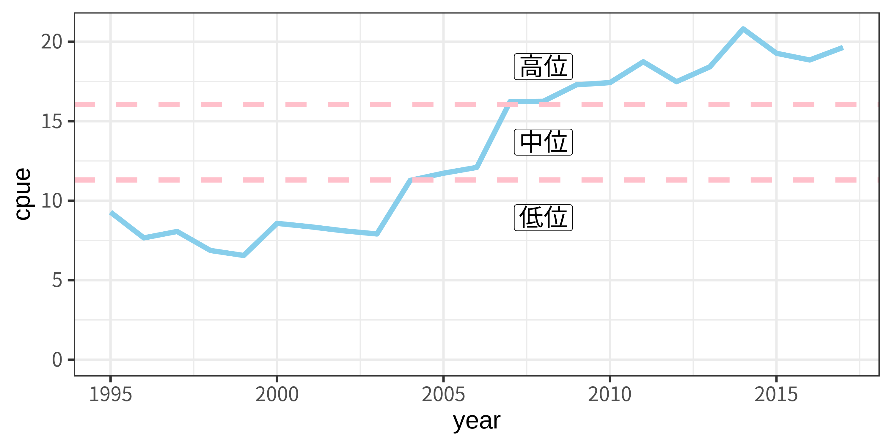

---

# 2-1系のMPの流れ

3.  $ABC_t=\delta C (1+k\frac{b}/{I})$ により$t$年のABCを算定
    - $\delta$: 低位の場合0.8, 中位・高位の場合1.0を用いる
    - $C$: 最新年の漁獲量, $k=1$, $b$: 資源量指標値の傾き、$I$: 資源量指標値の平均値
- いくつかのバリエーションあり（漁獲量の平均年、水準定義）
- 計算例：最新の漁獲量＝4453トン、水準＝高位→$\delta$=1.0、$b/I$=0.0095 :arrow_right: $ABC=4453 \times 1.0 \times (1+0.0095) = 4495$トン


---

## ２系ルール開発経緯
- オリジナル：平松一彦. オペレーティングモデルを用いたABC算定ルールの検討. 日本水産学会誌 2004; 70: 879-883.　**MPの式を提案**
- Ohshimo S, Naya M. Management strategy evaluation of fisheries resources in data-poor situations using an operating model based on a production model. JARQ 2014; 48: 237-244. **Production modelを用いた網羅的なパフォーマンスの検討**
- 市野川 桃子, 岡村 寛, 黒田 啓行, 由上 龍嗣, 田中 寛繁, 柴田 泰宙, 大下 誠二, 管理目標の数値化による最適なABC 算定規則の探索. 日本水産学会誌 2015; 81:206-218 **パフォーマンス指標を定義し、係数を決定**

---

# MSEの流れ（復習）

1. 管理の目的を（定性的に）決め、優先順位づけをおこなう
1. 管理目標を達成したかを測る定量的なパフォーマンス指標を選ぶ
1. 核となるシミュレーションモデルを決める
1. 候補となる管理方策を決める
1. 個々の管理方策のパフォーマンスをまとめる
1. 管理目的に最もそぐう管理方策を選択する

---

#  1-2. 管理の目的とパフォーマンス指標を選ぶ 

- いちばんあいまいだった部分 :arrow_right: あとまわし

---

# 3. 核となるシミュレーションモデル

- **個体群動態の構造**：プロダクションモデル型
- **Conditioning**： 2系が適用される資源一般が想定されているため、条件づけは実施せず
- **Reference set**： 現実にありえそうな範囲でパラメーを選択し、それらの網羅的な組み合わせからなる複数のOMを参照モデルセットとした

---

# 3. 核となるシミュレーションモデル

- **考慮した不確実性**: 以下を組み合わせた108通りのOM=参照モデルセット
   - 個体群成長率 $r$(=0.3,0.5,0.7)
   - プロセス誤差 $\sigma_r$ (=0.2, 0.4)
   - CPUEの観察誤差 $\sigma_I$ (=0.2, 0.4)
   - 過去の資源のトレンド（9タイプ)
- **頑健性テスト**
   - プロセス誤差の自己相関・管理の実施誤差（バイアス・ランダム）
---

### OMを実際に動かしてみよう
- abchanのページ　http://abchan.fra.go.jp/nc/htdocs/?page_id=765#_1543 から23kei_simulation.txtをダウンロード
- 重要な設定部分
   - 687行目：`if(0)`を`if(1)`に変えるとテストコードが実行される
   - 691行目：`n <- 100`（ひとつのOMの繰り返し計算回数。実際は1000回だが時間がかかるので）
   - 697行目：`delta <- rbind(c(1,1,0.8), c(1,0.9,0.7), c(1,1,0.9)) `　ほんとうはもっと多くの組み合わせがあるが、現行ルール1-1-0.8と対立ルール2つを比較してみる
   - 701行目：2系ルール（CPUEのみ利用）のテスト条件
   
```
source("23kei_simulation.txt")
# 関数を読んで2系のシミュレーションを実行。結果はbres5_ptに保存。
```

---

### 出力結果

```
head(bres5_pt$psdata[c("r","si","sr","delta2","S","E","Bave.ratio.median","Cave.ratio.median","Prob.B")])
    r  si  sr      delta2    S    E Bave.ratio.median Cave.ratio.median Prob.B
1 0.3 0.2 0.2   1-1-0.8-1 7500 7500          1.676547         0.3174916   0.00
2 0.3 0.2 0.2 1-0.9-0.7-1 7500 7500          1.771609         0.1854267   0.00
3 0.3 0.2 0.2   1-1-0.9-1 7500 7500          1.609329         0.4282188   0.00
4 0.3 0.2 0.2   1-1-0.8-1 7500 5000          1.579959         0.4412491   0.00
5 0.3 0.2 0.2 1-0.9-0.7-1 7500 5000          1.724002         0.2545851   0.00
6 0.3 0.2 0.2   1-1-0.9-1 7500 5000          1.364573         0.6182743   0.01
```
- r, si, sr, S, EはOMのパラメータ
- low, mid, high, kがMPのパラメータのセット
- 108通のOMの結果ひとつひとつで計算されたパフォーマンス指標
   - Bave.ratio.median: B/Bmsyの中央値
   - Cave.ratio.median: C/MSYの中央値
   - Prob.B: 20年間でSSBが0.2Bmsy以下に一回でもなる確率
---

### パフォーマンス指標：B/BMSYとC/MSY

- たとえば、１０８通りのB/B_MSYとC/MSYの分布を２つの管理方策で比較

<!---
png(file="figures/fig-2kei1.png",height=200,width=500)
par(mar=c(4,4,1,1))
-->

```
# 生のRを使う場合
psdata <- bres5_pt$psdata
plot(psdata$Bave.ratio.median,psdata$Cave.ratio.median,
     col=factor(psdata$delta2),pch=as.numeric(factor(psdata$delta2)),
	 xlab="B/Bmsy",ylab="C/MSY")
legend("topright",pch=1:3,col=1:3,legend=unique(psdata$delta2))	 
```
<!---
dev.off()
--->

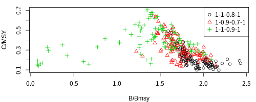

---

### パフォーマンス指標：B/BMSYとC/MSY
- たとえば、１０８通りのB/B_MSYとC/MSYの分布を２つの管理方策で比較

```
# ggplotを使う場合
library(tidyverse)
bres5_pt$psdata %>% ggplot() +
    geom_point(aes(x=Bave.ratio.median,y=Cave.ratio.median,
		col=delta2,shape=delta2),size=2)+
    theme_bw(base_size=20)+xlab("B/Bmsy")+ylab("C/MSY")
```

<!---
ggsave(g2,file="figures/fig-2kei2.png",height=4,width=10)		  
--->

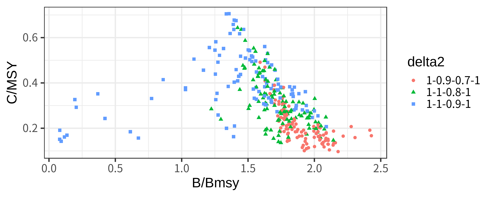

---

### パフォーマンス指標：B/BMSYとC/MSY
- 保守的な管理手法(1-0.9-0.7)は右下のほうにプロットが分布する傾向（漁獲量を犠牲にして資源保護を重視）
- どのOMも平均的にはB>B_MSY.どこまで保護を重視すべき？
- B/BMSYの中央値だけでは「リスク（分布の裾のほう）」を評価できない


---

### パフォーマンス指標：Prob.Bの導入

- Prob.B (20年間のうち1回でもB<0.2Bmsyを下回るreplicationが何回おこるか：1度でも危機的状況に陥ったことがあるか？) :arrow_right: **1-Prob.B=リスクの回避確率**
- 1-Prob.Bをパフォーマンス指標に使うと、資源が十分回復しているケースは1-Prob.B=1となり、スコアに影響しなくなる
- 「良い状態をさらに良くする」方策よりも「悪い状態を改善できる」方策のほうが重視される

--- 

# リスクの回避確率とB/BMSYとの関係

```
bres5_pt$psdata %>% ggplot() +
    geom_point(aes(y=1-Prob.B,x=Bave.ratio.median,
				   col=delta2,shape=delta2),size=2)+
    theme_bw(base_size=20)+ylim(0,NA)+xlim(0,NA)+
	ylab("1-Prob.B(リスクの回避)")+xlab("B/B_MSY")
```

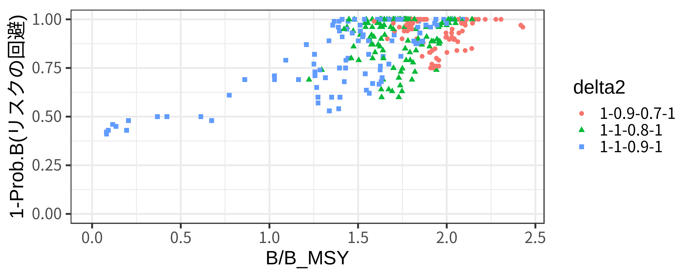

<!---
ggsave(file="figures/fig-2kei3.png",height=4,width=10)		  
--->

--- 

### パフォーマンス指標：Prob.BとC/MSY

- リスクの回避確率とC/MSYをプロット（右上のほうが良い方策）
- 漁獲量も資源量の安全性もある程度保証される1-Prob.B>0.8かつC/MSY>0.2のシナリオの数を数え、条件を満たすシナリオ数＝スコアとする（図の灰色の領域）
   - 離散値になるので乱数のゆらぎに対して頑健になる
   - 漁獲量と安全性のトレードオフによって、最適な方策を客観的に決められる
   - :smiling_imp: **管理目的が明確でなかったための苦肉の策でもあります**
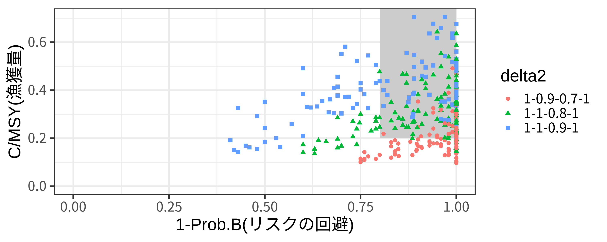

---

### Rコード
```
bres5_pt$psdata %>% ggplot() +
	geom_rect(ymin=0.2,ymax=1,xmin=0.8,xmax=1,fill=gray(0.8))+
    geom_point(aes(x=1-Prob.B,
                   y=Cave.ratio.median,
				   col=delta2,shape=delta2),size=2)+
    theme_bw(base_size=20)+ylim(0,NA)+xlim(0,1)+
	xlab("1-Prob.B(リスクの回避)")+ylab("C/MSY(漁獲量)")
```
---

<!---
ggsave(file="figures/fig-2kei4.png",height=4,width=10)		  
ggsave(file="figures/fig-2kei4-2.png",height=3,width=6)		  
--->

### 論文の値の再現

```
# シミュレーション回数は100回の結果だが1000回の結果とほぼ同じ
# 一番良い管理方策のTotal scoreは78点
> score_func(bres5_pt)
# A tibble: 2 x 5
  delta     Bscore Cscore Total   AAV
  <fct>      <int>  <int> <int> <dbl>
1 1-0.9-0.7    100     47    47 0.564
2 1-1-0.8       84     91    78 0.540
```		 

### 論文の図の比較

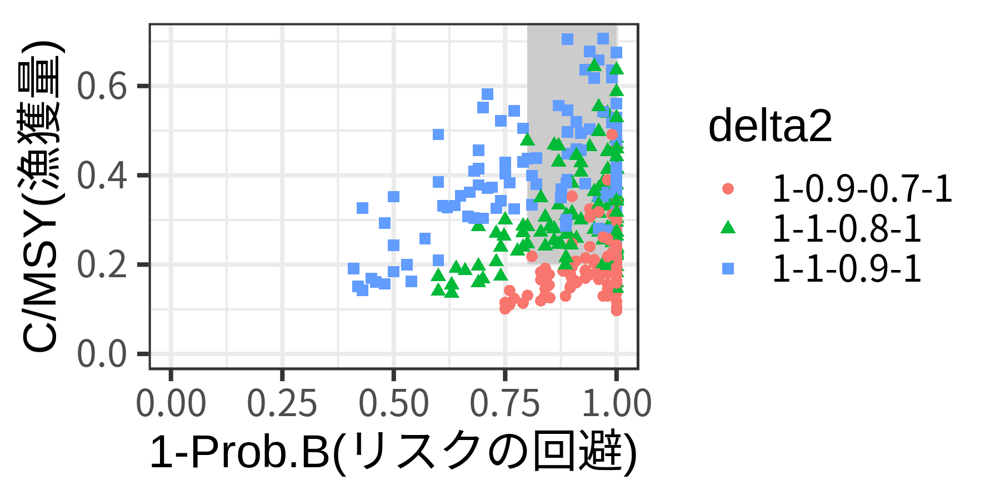 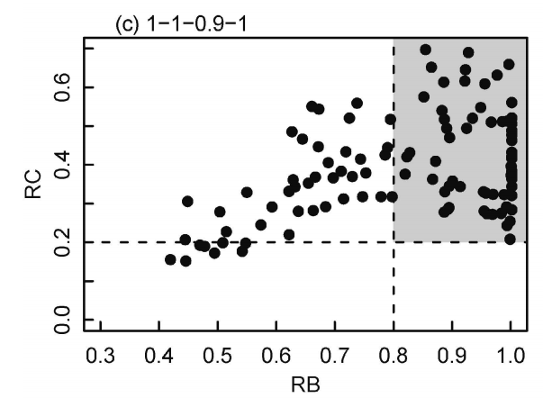

---

# :star: 新ルールにおける2系ルールも同じMSEで評価していきます :star:
- 少なくとも、「相対的に現行の2系ルールよりは良い」ような方策は選択できる
- しかし、一般的に利用されているMSEとはちょっと違っているような部分もあります（:bug:改良の余地:bug:）

---

# 2系MSEの特徴

1. 管理の目的を（定性的に）決め、優先順位づけをおこなう
1. 管理目標を達成したかを測る定量的なパフォーマンス指標を選ぶ
   - **最初に管理目標を明確にすることがMSEの重要な点だが、これが明確にならないまま進んだ　:arrow_right: 苦肉の策としてスコア方式によりMPを決定**
   - **新たな資源管理政策では「10年でB_MSY>Bが50％以上」という明確な目標があるので、これをパフォーマンス指標として導入するのも手か？**
1. 核となるシミュレーションモデルを決める
   - **条件づけ（Conditionig)はおこなっていない。これをきちんとおこなうことで、各系群の特徴を考慮した独自のMPが開発できる可能性**
   - **不確実性の範囲：「またがり資源」**
   - **2-2系...**

---

# 2系MSEの特徴(続き)
1. 候補となる管理方策を決める
   - **ここはかなりしっかりしている。特に新ルールでは相当のケースが試された模様。**
   - **より良いパフォーマンスを示すMPも、もしあったら提案OK。**
1. 個々の管理方策のパフォーマンスをまとめる
1. 管理目的に最もそぐう管理方策を選択する
   - **いつ・誰が決定？（プロセスの問題）**
---

<!-- header: まとめ -->

# MSE全般に対するまとめ

- やってよかった:smile:という声が大多数
   - TAではベースケースを一つしか選べないが、MSEでは「かもしれない」シナリオを取り込める（ホッケ道北系群）
   - 「シナリオ」として対立仮説をMSEに導入することにより、対立仮説のモデル化・定量化が促進され、科学的に意味のある議論にシフトできる（例：レジームシフト）
   - MSEの一番最初のステップに「管理目的」の設定がある：ステークホルダーをはじめから巻き込める

# :sparkles: :sparkles: Let's MSE :sparkles: :sparkles:

- ただし、MSEの質はピンキリ？「MSEで確かめた」＝「水戸黄門の印籠」ではない。内容の確認、評価は必要

---


